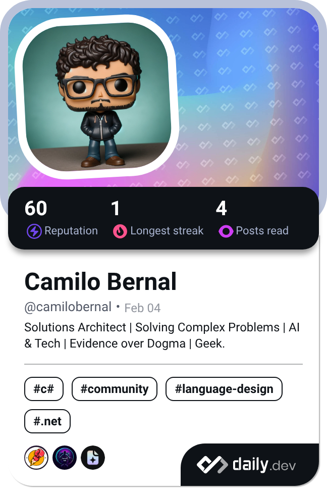

## · Camilo Bernal ·

### Arquitecto de Soluciones | +23 años de Experiencia| Bogotá, Colombia 🇨🇴

 

 

-00D9FF?style=flat-square)

 

---

## 🧠 Sobre mí

> 🚀 **Soy Arquitecto de Soluciones con más de 23 años diseñando productos de software que importan.**
> Mi visión no tiene límites en un stack concreto: soy agnóstico a la tecnología y apasionado por la estrategia, el código y la innovación real. Desde FinTech hasta IA, construyo el puente entre la ambición del negocio y la precisión técnica.

 

<table>
<tr>
<td valign="top" width="50%">

**💡 Quién soy**

- 🎯 Arquitecto de Soluciones en **Sofka Technologies**
- 🏗️ +23 años construyendo software en BFSI, Salud, Transporte y Gobierno
- 🧩 Tech Agnostic: mi visión supera cualquier stack
- 🎓 Docente y conferencista en desarrollo de software
- 🥁 Baterista apasionado y entusiasta de Star Trek
- 🤝 Coorganizador de comunidades técnicas en Colombia

</td>
<td valign="top" width="50%">

**🔭 Actualmente**

- 🔨 **Building:** Platform Engineering & AI Agents
- 🌱 **Learning:** Rust, WebAssembly, Agentic AI Patterns
- 🎯 **Focus:** Cloud-Native Architecture & FinOps
- 📖 **Reading:** Technical papers on LLM Orchestration
- 🚀 **Mission:** Hacer que el código cuente una historia

</td>
</tr>
</table>

📖 Leer mi historia completa

 

Soy un desarrollador de software apasionado, con más de 23 años de experiencia en la construcción de productos tecnológicos de alto impacto. He aportado en proyectos de diferentes verticales: Salud, Transporte, FinTech, Startups y proyectos de Inteligencia Artificial.

Mi rol está orientado tanto a la gestión estratégica de equipos técnicos como a la construcción directa de productos. He liderado como Arquitecto Líder, Gerente de Desarrollo, Director de I+D+i y actualmente como Gerente del CoE de Desarrollo y Arquitectura en Sofka.

Soy fiel a los principios ágiles y al pensamiento de arquitectura pragmática: busco siempre el equilibrio entre tecnología de punta, necesidades del negocio y deuda técnica controlada. Me apasiona el mentoring técnico, la calidad desde la incepción (Shift-Left) y la construcción de comunidad.

---

## ⚙️ Mi Stack Tecnológico

**☁️ Cloud & DevOps**

**🔧 Backend & Architecture**

**🎨 Frontend**

**🧠 AI & Data**

**🏗️ Architecture Patterns**

---

## 📊 GitHub en Tiempo Real

<table>
<tr>
<td width="49%" align="center">

</td>
<td width="49%" align="center">

</td>
</tr>
<tr>
<td align="center" colspan="2">

</td>
</tr>
</table>

 

 

 

<picture>
  <source media="(prefers-color-scheme: dark)" srcset="https://raw.githubusercontent.com/CamiloBernal/CamiloBernal/output/github-contribution-grid-snake-dark.svg" />
  <source media="(prefers-color-scheme: light)" srcset="https://raw.githubusercontent.com/CamiloBernal/CamiloBernal/output/github-contribution-grid-snake.svg" />
  
</picture>

---

➡️ [Ver todos mis repositorios ordenados por estrellas](https://github.com/CamiloBernal?tab=repositories&sort=stargazers)

---

## 📡 Actividad Reciente

<!-- ACTIVITY_START -->
⏳ Cargando actividad reciente... Vuelve pronto.
<!-- ACTIVITY_END -->

---

## 📝 Últimas Ideas del Blog

<!-- BLOG_START -->
📖 [Lee mis artículos en blog.camilobernal.dev](https://blog.camilobernal.dev)
<!-- BLOG_END -->

---

## 💡 Lo que estoy leyendo

---

## 🏆 Credenciales y Reconocimientos

**Certificaciones**

 

🤝 Comunidad y Docencia

 

- 🎓 **Docente** en instituciones de educación superior — Desarrollo de Software
- 🎙️ **Conferencista** en eventos de tecnología en Colombia
- 🤝 **Coorganizador** de comunidades técnicas en Colombia
- 🏢 **Sofka Educator** — Mentor y formador de talento técnico

 

**Sectores donde he generado impacto**

---

## 📢 Conectemos

---

## 📍 Encuéntrame

> *"El arquitecto no solo diseña sistemas. Diseña el futuro de las organizaciones."*
> — Camilo Bernal

 

Construido con 💜 desde Bogotá, Colombia 🇨🇴 | Automatizado con GitHub Actions 🤖 | Última actualización: <!-- TIMESTAMP -->

<!-- Updated: 2026-02-21 00:00 COT | Version: 2.0.0 -->
